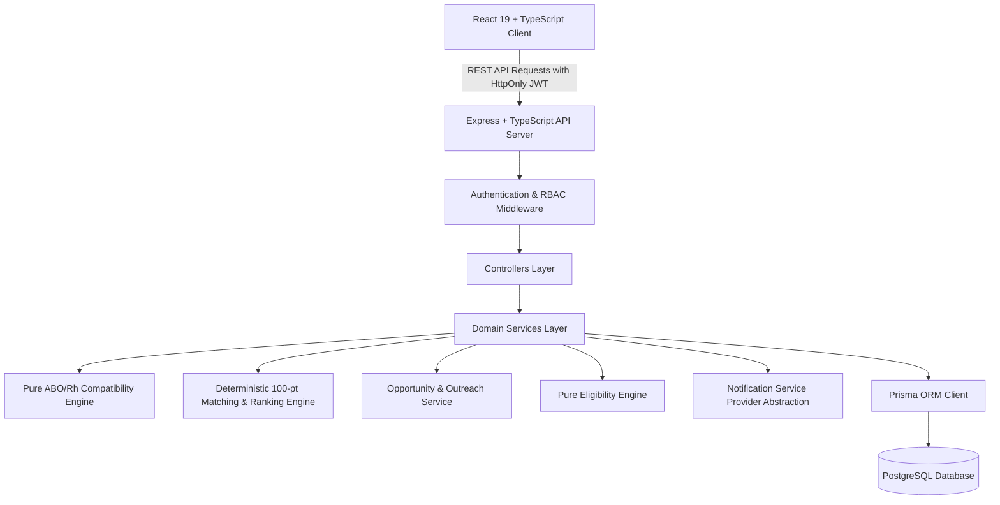

# 🩸 HemaCare — Blood Donation Management System

A production-oriented, scalable, and secure **Blood Donation Management, Emergency Blood Request Coordination & Donor Opportunity Outreach Web Application** designed with clean architectural boundaries, strict RBAC authorization, automated eligibility calculations, deterministic candidate matching, opportunity response tracking, privacy redaction, and comprehensive automated test coverage.

---

## 📑 Table of Contents

1. [Project Overview](#-project-overview)
2. [Architecture & Design Decisions](#-architecture--design-decisions)
3. [Donor Opportunities & Outreach System (Phase 12)](#-donor-opportunities--outreach-system-phase-12)
4. [Blood Requests & Donor Matching Engine](#-blood-requests--donor-matching-engine)
5. [Technology Stack](#-technology-stack)
6. [Monorepo Structure](#-monorepo-structure)
7. [Database Schema & Models](#-database-schema--models)
8. [Eligibility & Compatibility Engines](#-eligibility--compatibility-engines)
9. [API Specification](#-api-specification)
10. [Security & Authorization Model](#-security--authorization-model)
11. [Prerequisites & Environment Setup](#-prerequisites--environment-setup)
12. [Local Development Commands](#-local-development-commands)
13. [Testing & Quality Assurance (104 Passing Tests)](#-testing--quality-assurance-104-passing-tests)
14. [Production Build & Deployment](#-production-build--deployment)

---

## 🏥 Project Overview

HemaCare bridges voluntary blood donors, clinical collection teams, and hospital coordinators through a secure registry and coordination platform:

- **For Donors:**
  - Fast, accessible donor registration with blood group specification.
  - Personalized Donor Dashboard with lifetime donation counts, next-donation countdown, and active opportunities alert widgets.
  - Pure automated **Eligibility Engine** calculating age thresholds (18–65) and interval cooldowns (56 days).
  - **Donation Opportunities Portal:** View localized emergency requests matching blood type, review hospital location and deadline, and respond with "I'm Available" (Accept) or "Can't Help" (Decline with structured reason).
  - **In-App Notification Bell & Real-time Badges:** Track outreach alerts, mark as read, and view unread counts.
  - **Outreach & Notification Consent Preferences:** Granular consent toggles on profile.
  - Profile management for personal contact details and residential address.
  - Complete chronological history of verified clinical donation sessions.

- **For Clinical Administrators & Staff:**
  - Secure staff portal with real-time KPI overview (Active Donors, Eligible Donors, Recent Collections, Open Blood Requests).
  - Active donors by blood group distribution visualization (`O-`, `O+`, `A+`, `A-`, `B+`, `B-`, `AB+`, `AB-`).
  - Server-side searchable, filterable, and paginated donor directory.
  - Detailed donor clinical modal with historical records.
  - Procedure logging modal to record whole blood donations with atomic `lastDonationAt` updating and opportunity fulfillment.
  - Non-destructive soft-deactivation mechanism (`deletedAt`) to preserve historical auditability.
  - **Clinical Blood Requests & Emergency Coordination:**
    - Create and manage hospital blood requests with urgency levels (`CRITICAL`, `HIGH`, `NORMAL`, `LOW`).
    - Deterministic multi-factor candidate matching and ranking engine (0–100 score).
    - **Donor Outreach & Opportunity Batching:**
      - Batch opportunity dispatching (1, 5, 10 candidates per batch).
      - Real-time outreach KPI tracking (Pending, Viewed, Accepted, Declined, Expired, Fulfilled).
      - Anti-fatigue safeguards preventing duplicate notifications.
      - Opportunity cancellation workflows.
    - Atomic donation-to-request fulfillment linking transactions.
    - Automatic request status transitions (`OPEN` -> `PARTIALLY_FULFILLED` -> `FULFILLED`).

---

## 🏛 Architecture & Design Decisions



### Key Architectural Boundaries:
1. **Strict Frontend/Backend Isolation:** The frontend never directly imports Prisma models, database drivers, or server secrets. All interactions flow through typed API service modules.
2. **Server-Decided Roles (Anti-Escalation):** Public registration strictly enforces `role: DONOR` on the server. Client-supplied role injections are ignored and validated against Zod schemas.
3. **Pure Domain Logic Separation:** Eligibility calculation (`eligibility.service.ts`), ABO/Rh compatibility (`blood-compatibility.service.ts`), and matching ranking (`matching.service.ts`) are pure, testable functions decoupled from database/HTTP concerns.
4. **Privacy Invariant & IDOR Defense:** Donor endpoints only return redacted blood request fields (`bloodGroup`, `urgency`, `location`, `hospitalName`, `requiredBy`). Private medical diagnosis, notes, and patient references are never exposed to donors.
5. **Fresh Eligibility Recheck on Acceptance:** When a donor accepts an opportunity, the server performs a fresh server-side screening check against the donor's latest donation timestamp to prevent invalid accepts.
6. **Atomic Transactions:** Critical operations execute inside `prisma.$transaction` blocks to guarantee ACID invariants.

---

## 🎯 Donor Opportunities & Outreach System (Phase 12)

### Core Distinction
The system maintains strict domain separation across the coordination lifecycle:
$$\text{Candidate} \neq \text{Opportunity} \neq \text{Notification} \neq \text{Response} \neq \text{Donation}$$

- **Candidate:** A donor profile matching blood type and interval readiness.
- **Opportunity:** A formal, tracked invitation created by clinical staff for a specific candidate donor.
- **Notification:** The communication channel dispatch (`IN_APP`, `SMS`, `EMAIL`) alerting the donor.
- **Response:** The donor's voluntary reply (`ACCEPTED` or `DECLINED`).
- **Donation:** A verified, clinically logged blood collection procedure.

> **Crucial Rule:** An accepted opportunity **NEVER** automatically logs a donation. A donation is only recorded when clinical staff physically complete collection at a medical facility.

### Opportunity State Machine
```
[ PENDING ] ───(Donor views)───► [ VIEWED ]
     │                                │
     ├───(Donor accepts)──────────────┼───► [ ACCEPTED ] ───(Staff logs donation)───► [ FULFILLED ]
     │                                │
     ├───(Donor declines)─────────────┼───► [ DECLINED ]
     │                                │
     ├───(Deadline passes)────────────┼───► [ EXPIRED ]
     │                                │
     └───(Admin cancels)──────────────┴───► [ CANCELLED ]
```

---

## 🩸 Blood Requests & Donor Matching Engine

### Red-Cell ABO/Rh Compatibility Matrix
The system implements pure clinical red-cell compatibility rules:
- **O- Recipient:** Can only receive from `O-` (Universal donor to others).
- **O+ Recipient:** Receives from `O-`, `O+`.
- **A- Recipient:** Receives from `O-`, `A-`.
- **A+ Recipient:** Receives from `O-`, `O+`, `A-`, `A+`.
- **B- Recipient:** Receives from `O-`, `B-`.
- **B+ Recipient:** Receives from `O-`, `O+`, `B-`, `B+`.
- **AB- Recipient:** Receives from `O-`, `A-`, `B-`, `AB-`.
- **AB+ Recipient:** Receives from all 8 blood groups (Universal recipient).

### 100-Point Deterministic Candidate Ranking Algorithm
1. **Blood Group Compatibility (Max 40 points):**
   - Exact ABO/Rh match: `40 points`
   - Compatible alternative donor group: `30 points`
2. **Eligibility & Interval Readiness (Max 25 points):**
   - Immediate clinical eligibility (age 18–65, >=56 days since last donation): `25 points`
   - Ineligible or active cooldown (<56 days): `Excluded from candidate pool`
3. **Location Proximity (Max 20 points):**
   - Donor city matches request hospital/regional location: `20 points`
   - Different regional location: `5 points`
4. **Donation History Cadence (Max 10 points):**
   - 3+ lifetime verified donations: `10 points`
   - 1–2 lifetime verified donations: `6 points`
   - First-time voluntary donor: `3 points`
5. **Recency Recalibration (Max 5 points):**
   - Last donation was >180 days ago: `5 points`
   - Last donation was 56–180 days ago: `3 points`

---

## 🛠 Technology Stack

- **Frontend:** React 19, TypeScript, Vite, Tailwind CSS, TanStack React Query v5, Lucide React
- **Backend:** Node.js, Express, TypeScript, Prisma ORM, PostgreSQL
- **Security & Session:** HttpOnly `SameSite=Lax` JWT Cookies, bcrypt (cost factor 12), Helmet, CORS, Rate Limiting
- **Testing:** Vitest, Supertest

---

## 🧪 Testing & Quality Assurance (104 Passing Tests)

The platform is covered by **104 automated tests across 11 test suites**:

```bash
$ npm test --workspace=server

 ✓ tests/auth.test.ts (9 tests)
 ✓ tests/authorization-security.test.ts (9 tests)
 ✓ tests/admin.test.ts (9 tests)
 ✓ tests/donor.test.ts (4 tests)
 ✓ tests/opportunity.test.ts (14 tests)
 ✓ tests/blood-request.test.ts (13 tests)
 ✓ tests/hardening-security.test.ts (18 tests)
 ✓ tests/notification.test.ts (4 tests)
 ✓ tests/matching.test.ts (3 tests)
 ✓ tests/eligibility.test.ts (10 tests)
 ✓ tests/blood-compatibility.test.ts (11 tests)

 Test Files  11 passed (11)
      Tests  104 passed (104)
```

---

## 🚀 Local Development Commands

```bash
# Install dependencies
npm install

# Run database migrations
npm run prisma:migrate --workspace=server

# Start backend dev server (port 5000)
npm run dev --workspace=server

# Start frontend dev server (port 5173)
npm run dev --workspace=client

# Run full test suite
npm test --workspace=server

# Typecheck all workspaces
npm run typecheck --workspaces

# Build production bundles
npm run build --workspaces
```
