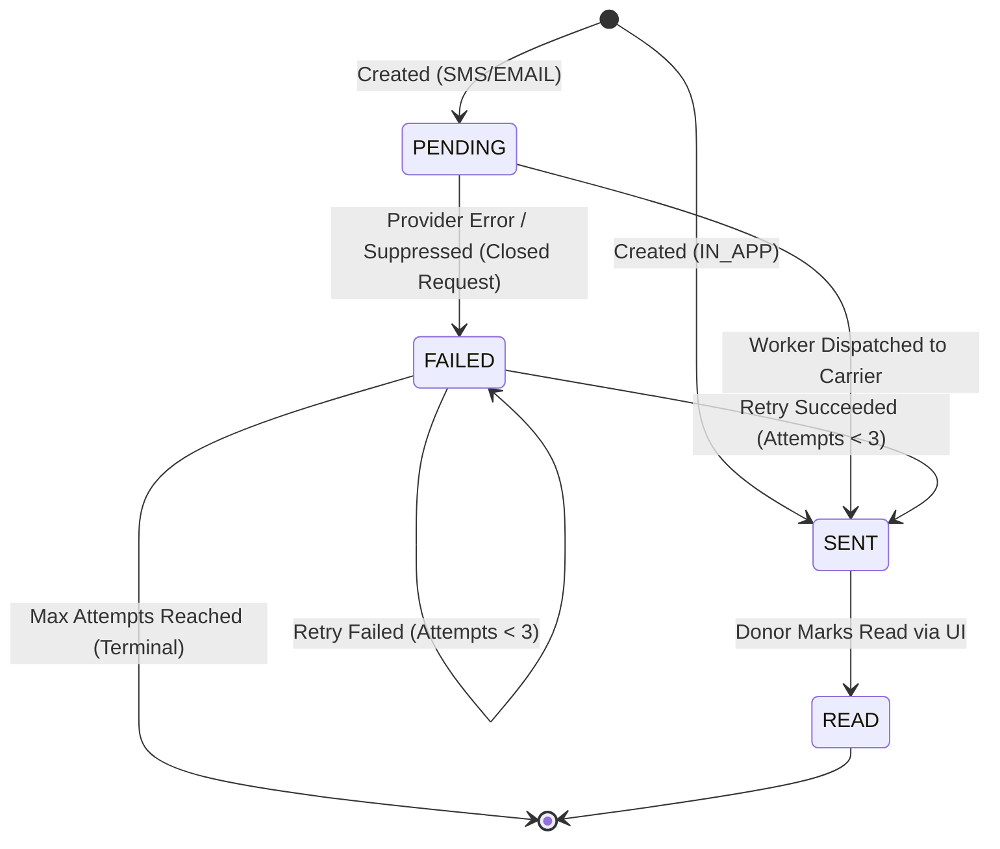

# PHASE 19 — NOTIFICATION STATE MACHINE SPECIFICATION

**Audit & Implementation Date:** September 1, 2026  
**Engineering Suite:** Production Notification Reliability Suite  

---

## 1. Notification States

| State | Scope | Description | Terminal? |
| :--- | :--- | :--- | :---: |
| **`PENDING`** | External (SMS / Email) | Enqueued in PostgreSQL database, awaiting background worker claim. | No |
| **`SENT`** | All Channels | Successfully dispatched by carrier provider or rendered in-app. | No (Can become `READ`) |
| **`FAILED`** | External (SMS / Email) | Encountered carrier failure, non-retryable error, or suppressed. | Yes (If max attempts reached or suppressed) |
| **`READ`** | In-App (`IN_APP`) | Acknowledged or viewed by authenticated donor via UI. | **Yes** |

---

## 2. Allowed State Transitions

---

## 3. Transition Rules & Triggers

1. **`PENDING` → `SENT`:**
   - Trigger: Background worker successfully calls `provider.send()` and receives `status: SENT` with `externalId`.
   - Mutated Fields: `sentAt = new Date()`, `providerMessageId = externalId`.

2. **`PENDING` → `FAILED` (Suppressed):**
   - Trigger: Underlying blood request cancelled, expired, or fulfilled before dispatch.
   - Mutated Fields: `failedAt = new Date()`, `errorCode = 'SUPPRESSED_REQUEST_CANCELLED' | 'SUPPRESSED_REQUEST_FULFILLED'`, `attemptCount = 3` (Terminal).

3. **`PENDING` → `FAILED` (Carrier Failure):**
   - Trigger: Carrier returns 4xx/5xx or timeout.
   - Mutated Fields: `failedAt = new Date()`, `errorCode = err.message`, `attemptCount = 1`.

4. **`FAILED` → `SENT` (Retry):**
   - Trigger: Worker processes retry candidate after exponential backoff (30s for attempt 1, 2m for attempt 2) or admin triggers manual retry.

5. **`SENT` → `READ`:**
   - Trigger: Donor calls `POST /api/v1/donor/notifications/:id/read` or `POST /api/v1/donor/notifications/read-all`.
   - Mutated Fields: `readAt = new Date()`, `status = READ`.
